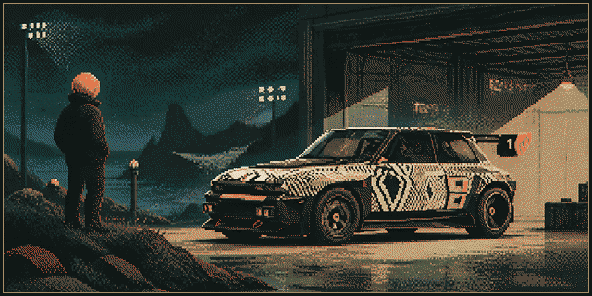

# Renault 5 Turbo 3E — interactive WebGL tribute

A personal, fan-made experiment that turns a vehicle into a cinematic object to explore. The live experience combines a guided sequence, twenty-plus annotated points of interest, multilingual navigation and optional sound.

> **Fan-made project. Not affiliated with, endorsed by or sponsored by Renault or the Renault Group.** Renault and Renault 5 are trademarks of their respective owners.

## Quest brief

| | |
| --- | --- |
| **Format** | Interactive 3D web experience |
| **Focus** | Interaction design, cinematic sequencing and WebGL presentation |
| **Status** | Live personal experiment |
| **Destination** | [Enter the experience](https://showroomcar-alpha.vercel.app/) |

## The challenge

Product pages often flatten a three-dimensional object into a gallery of disconnected images. This experiment asks a different question: **can the browser make looking at an object feel like moving through a short film?**

## What the experience contains

- A twenty-step cinematic sequence with visible progress.
- An explorable 3D Renault 5 Turbo 3E scene.
- Annotated details spanning exterior, interior, powertrain, chassis and heritage.
- English, Spanish and French interface options.
- Controls for the cinematic sequence, annotations, car visibility and sound.

## System flow

1. The visitor chooses the guided cinematic sequence or free exploration.
2. Navigation, language, sound and visibility controls update the experience state.
3. The cinematic controller coordinates camera movement, progress and the active view.
4. The Three.js/WebGL scene and point-of-interest layer respond to that shared state.
5. The visitor can return to the sequence or continue inspecting annotated details independently.

## Interaction notes

- Guidance stays optional: visitors can follow the sequence or inspect points independently.
- The car remains the visual protagonist; controls sit around the scene instead of covering it.
- Motion establishes rhythm, while annotation turns spectacle into information.

## Craft

`Three.js` · `WebGL` · `Cinematic camera` · `Interactive annotations` · `Responsive UI`

## Credits and rights

This repository documents a personal design and development experiment. It does not redistribute the private project source or proprietary vehicle assets. Screenshots and case-study artwork are © Raúl Iglesias Julios unless otherwise noted.

— [Live experience](https://showroomcar-alpha.vercel.app/) · [Back to the profile](https://github.com/RaulJuliosIglesias)
